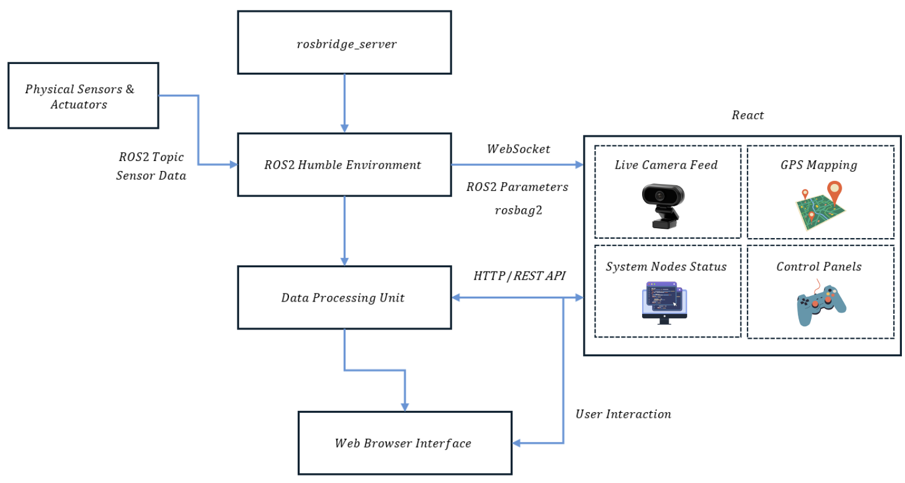

## ARES9 Rover – Software Monitoring & Visualization Dashboard (Developing) 🚀

A Vite + React dashboard for rover software monitoring, teleoperation, and system visualization. The UI in `rover-dashboard-js/src/App.jsx` renders simulated real‑time telemetry, ROS2 node/topic health, power metrics, logs, and teleop panels with a dark, operator‑grade theme.



## Features ✨
- **Overview**: Composite system status with an animated rover visualization, live feed placeholder, and key metrics (battery, CPU, temperature, mission time).
- **Charts**: `chart.js` + `react-chartjs-2` line and doughnut charts with dark theme defaults and responsive interactions.
- **ROS2 Monitor**: Mock ROS2 node states and topic rates updated on intervals to simulate bridge health.
- **Teleop**: Panels for motion, arm, system, and connection settings (WebSocket URL placeholder for a ROS bridge).
- **Logs & Alerts**: Streaming event log with levels, alert summary, and simple health bars.

## Tech Stack 🛠️
- React 19, Vite 7
- Tailwind CSS 4 utilities (via `@tailwind base/components/utilities` in `src/index.css`)
- lucide-react icons
- chart.js 4 with react-chartjs-2 5

## Project Layout 📁
- `rover-dashboard-js/` – standalone Vite app
  - `src/App.jsx` – main dashboard (tabs, telemetry generation, ROS2 mock, charts)
  - `src/components/ui/` – minimal `Card` and `Button` primitives
  - `src/lib/utils.js` – `cn` utility for class merging

## Getting Started 
Requirements: Node 18+ (LTS recommended), npm 9+.

1) Install
```
cd rover-dashboard-js
npm install
```

2) Develop
```
npm run dev
```
Vite will print a local URL; open it in a browser.

3) Build & Preview
```
npm run build
npm run preview
```

<!--## Configuration & Integration
 - The dashboard currently uses simulated telemetry via timers in `App.jsx` (`generateComplexHistory`, log ticker, ROS status updates).
- To integrate with a ROS/ROS2 bridge (e.g., rosbridge / custom WS):
  - Replace the mock intervals with real subscriptions in the relevant tabs.
  - Use the "ROS2 Bridge Settings" panel’s URL input as your connection source of truth.
  - Map incoming topics to datasets used by charts (`systemPerformanceData`, `powerSystemData`). -->

<!-- ## Scripts (in `rover-dashboard-js/package.json`)
- `dev`: start Vite dev server
- `build`: production build
- `preview`: preview built assets
- `lint`: run ESLint -->

## Notes 
- Tailwind classes are used directly; ensure Tailwind is processed by Vite (already configured via PostCSS).
- Icons and charts are tree‑shaken by Vite.